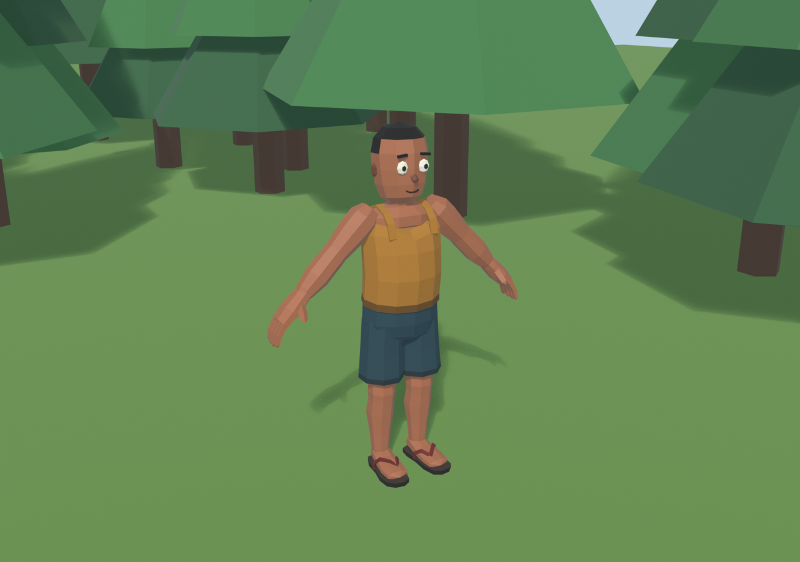

# SK_Fisherman

*Generated 2026-10-02 23:51 with blender-lpm-skill*

## Prompt

> Casual forest fisherman hero, How to Fish style: tank top, knee shorts, flip-flops, empty relaxed hands. 1.70 m, 1500-2500 tris, one palette texture, Unity Humanoid rig, A-pose, +Z forward.

## Notes

3 iterations. v1 too lanky (thin long arms, small head/hands) and the hair read as a beanie. v2 got chunky proportions (head x1.2, thicker shorter limbs, hands x1.35, feet x1.12), a wider torso, and lighter shorts. v3 lowered the deltoid peak, trimmed the nape hair, and lightened the skin. Deliberate deviations from the gate class: flat shading (requested low-poly style) and separate closed skinned shells (fingers, eyes, straps) instead of one welded skin; all weighted, no seams visible. Weights: per-part distance-to-bone, max 3 influences, restricted per part so limbs never pick up the opposite side. The pose test (raised and bent arms, lifted knee, spine twist, head turn) deforms cleanly.

## Metrics

| Metric | Value |
| --- | --- |
| triangles | 2440 |
| vertices | 1306 |
| faces | 1286 |
| dimensions_m | [1.327, 0.3741, 1.7] |
| meshes | 3 |
| blender | 5.2.2 LTS |
| materials | ['M_SK_Fisherman'] |
| images | ['SK_Fisherman_BaseColor 128x32', 'SK_Fisherman_MaskMap 128x32'] |
| gates | PASS |

## Renders




## Recipe

```python
"""
Forest fisherman hero - stylized low-poly character, How-to-Fish style.
Brief: casual forest fisherman, 1.70 m, 1500-2500 tris, 1 palette material, Unity Humanoid rig, A-pose.

  bl.py --script fisherman_recipe.py -- --out _work/fisherman/SK_Fisherman

Three skinned meshes (Body / Clothes / Sandals) share ONE palette material. Metres, Z up, front = -Y
(exported as Unity +Z forward). Skin weights are assigned per part from distance to the bones the part
is allowed to follow, so limbs never pick up weights from the wrong side.
"""
import math
import os
import sys

sys.path.insert(0, "/home/avoided7/.claude/skills/blender-lpm-skill/scripts")
import bmesh  # noqa: E402
import bpy  # noqa: E402
from mathutils import Matrix, Vector  # noqa: E402

import lpm  # noqa: E402
import lpm_kit as kit  # noqa: E402

argv = sys.argv[sys.argv.index("--") + 1:] if "--" in sys.argv else []
OUT = argv[argv.index("--out") + 1] if "--out" in argv else "_work/fisherman/SK_Fisherman"

HEIGHT = 1.70
APOSE = 45.0          # arm angle below horizontal
HAIR = True
BUDGET = 2500

lpm.reset()
P = lpm.Palette([
    ("skin", "#c99f82", 0.0, 0.65), ("skin_dark", "#a87d62", 0.0, 0.65),
    ("shirt", "#cba85e", 0.0, 0.85), ("shirt_dark", "#a2843f", 0.0, 0.85),
    ("shorts", "#5d7f86", 0.0, 0.85), ("shorts_dark", "#48666d", 0.0, 0.85),
    ("sole", "#4e3d33", 0.0, 0.9), ("sole_top", "#7b6450", 0.0, 0.85),
    ("strap", "#a4553f", 0.0, 0.8), ("eye", "#ece6da", 0.0, 0.4),
    ("pupil", "#1f1b18", 0.0, 0.4), ("mouth", "#6b3a2e", 0.0, 0.7),
    ("hair", "#3e2c21", 0.0, 0.9), ("brow", "#33241b", 0.0, 0.9),
])

V = Vector
PARTS = {"Body": [], "Clothes": [], "Sandals": []}   # mesh -> [(object, allowed bones)]


def add(group, ob, bones, mirror=True):
    PARTS[group].append((ob, bones))
    if mirror:
        r = lpm.mirror_x(ob)
        PARTS[group].append((r, [b.replace("Left", "Right") for b in bones]))


# --------------------------------------------------------------------------- loft builder

def loft(name, rings, sides=8, color=0, ref=(0, 1, 0), phase=0.0, caps=True):
    """Chain of cross-section rings -> one closed tube with an edge loop per ring.
    ring = (centre, rx, ry[, ref]); rx/ry = 0 makes a pole. ry runs along `ref`, rx across it."""
    cs = [V(r[0]) for r in rings]
    verts, idx = [], []
    for i, r in enumerate(rings):
        c, rx, ry = cs[i], r[1], r[2]
        if rx <= 1e-6 and ry <= 1e-6:
            verts.append(c); idx.append([len(verts) - 1]); continue
        t = (cs[min(i + 1, len(cs) - 1)] - cs[max(i - 1, 0)]).normalized()
        rv = V(r[3]) if len(r) > 3 else V(ref)
        a = (rv - t * rv.dot(t)).normalized()
        b = a.cross(t).normalized()
        base = len(verts)
        for k in range(sides):
            ang = phase + 2 * math.pi * k / sides
            verts.append(c + b * (rx * math.cos(ang)) + a * (ry * math.sin(ang)))
        idx.append(list(range(base, base + sides)))
    faces = []
    for A, B in zip(idx, idx[1:]):
        if len(A) == 1:
            faces += [(A[0], B[(k + 1) % sides], B[k]) for k in range(sides)]
        elif len(B) == 1:
            faces += [(A[k], A[(k + 1) % sides], B[0]) for k in range(sides)]
        else:
            faces += [(A[k], A[(k + 1) % sides], B[(k + 1) % sides], B[k]) for k in range(sides)]
    if caps and len(idx[0]) > 1:
        faces.append(tuple(reversed(idx[0])))
    if caps and len(idx[-1]) > 1:
        faces.append(tuple(idx[-1]))
    return lpm._object(name, lpm._bm_from([tuple(v) for v in verts], faces), color)


def deform(ob, fn):
    for v in ob.data.vertices:
        v.co = fn(v.co.copy())
    ob.data.update()
    return ob


# --------------------------------------------------------------------------- head & neck

FRONT = -math.pi / 2          # phase that puts a vertex column on the face centre line
head = loft("head", [
    ((0, -0.012, 1.400), 0.050, 0.046),
    ((0, -0.010, 1.425), 0.082, 0.082),
    ((0, -0.004, 1.475), 0.100, 0.100),
    ((0, 0.000, 1.535), 0.108, 0.108),
    ((0, 0.004, 1.595), 0.112, 0.110),
    ((0, 0.006, 1.650), 0.100, 0.100),
    ((0, 0.006, 1.690), 0.064, 0.064),
    ((0, 0.006, 1.708), 0, 0),
], sides=10, color=P["skin"], phase=FRONT)
if HAIR:   # short crop: top and back of the skull, sideburns stop above the ears
    lpm.paint(head, P["hair"], where=lambda c, n, i: c.z > 1.66 or (c.z > 1.6 and n.y > -0.55) or (c.z > 1.53 and n.y > 0.2) or (c.z > 1.475 and n.y > 0.7))
HEAD_PARTS = [head]

neck = loft("neck", [((0, 0.006, 1.25), 0.066, 0.062), ((0, 0.004, 1.32), 0.062, 0.058), ((0, 0.0, 1.40), 0.060, 0.056)],
            sides=8, color=P["skin"], phase=FRONT)
add("Body", neck, ["Chest", "Neck", "Head"], mirror=False)

eye = kit.blob("eye_L", (0.040, 0.026, 0.044), at=(0.046, -0.098, 1.528), color=P["eye"], segments=8, rings=4)
pupil = kit.blob("pupil_L", (0.017, 0.010, 0.019), at=(0.047, -0.113, 1.540), color=P["pupil"], segments=6, rings=3)
brow = lpm.box("brow_L", (0.040, 0.012, 0.010), at=(0.048, -0.104, 1.585), color=P["brow"])
lpm.rotate(brow, -8, "Y", about=(0.048, -0.104, 1.59))
ear = kit.blob("ear_L", (0.022, 0.040, 0.055), at=(0.106, 0.012, 1.502), color=P["skin_dark"], segments=6, rings=3)
for part in (eye, pupil):          # eyes a touch larger (still small, readable at mid distance)
    lpm.scale(part, 1.18, 1.0, 1.18, about=(0.046, -0.098, 1.55))
lpm.move(brow, 0, 0, 0.006); lpm.rotate(brow, 14, "Y", about=(0.048, -0.104, 1.59))    # raised, friendly
HEAD_PARTS += [eye, pupil, brow, ear]
nose = loft("nose", [((0, -0.098, 1.513), 0.016, 0.014), ((0, -0.118, 1.500), 0.013, 0.010), ((0, -0.122, 1.492), 0, 0)],
            sides=5, color=P["skin_dark"], ref=(0, 0, 1), phase=math.pi / 2)
mouth = lpm.sweep("mouth", [(-0.026, 0.004), (-0.012, -0.002), (0.012, -0.002), (0.026, 0.004),
                            (0.026, 0.010), (0.012, 0.004), (-0.012, 0.004), (-0.026, 0.010)],
                  depth=0.012, at=(0, -0.091, 1.452), color=P["mouth"])
HEAD_PARTS += [nose, mouth]
HEAD_XF = Matrix.Translation((0, 0, 1.345)) @ Matrix.Diagonal((1.2, 1.2, 1.19, 1)) @ Matrix.Translation((0, 0, -1.40))
for part in HEAD_PARTS:
    part.data.transform(HEAD_XF)
    add("Body", part, ["Head"], mirror=part.name.endswith("_L"))

# --------------------------------------------------------------------------- torso skin yoke (shoulders + neckline)

yoke = kit.blob("yoke", (0.40, 0.22, 0.15), at=(0, 0.004, 1.195), color=P["skin"], segments=10, rings=5)
add("Body", yoke, ["Chest", "LeftShoulder", "RightShoulder", "Neck"], mirror=False)

# --------------------------------------------------------------------------- arms (A-pose) + hands

SHOULDER = V((0.205, 0.0, 1.275))
T = V((math.cos(math.radians(APOSE)), 0.0, -math.sin(math.radians(APOSE))))
Y = V((0, 1, 0))
B = Y.cross(T).normalized()            # palm-side direction (down / toward the body in A-pose)
WRIST_S, HS = 0.40, 1.35               # wrist distance from the shoulder, chunky-hand scale


def arm_pt(s, side=0.0, palm=0.0):
    return SHOULDER + T * s + Y * side + B * palm


def hand_pt(u, side=0.0, palm=0.0):
    return arm_pt(WRIST_S + u * HS, side * HS, palm * HS)


arm = loft("arm_L", [
    (arm_pt(-0.07), 0.046, 0.048),
    (arm_pt(-0.02), 0.071, 0.075),     # deltoid
    (arm_pt(0.045), 0.072, 0.072),
    (arm_pt(0.11), 0.066, 0.066),      # biceps
    (arm_pt(0.18), 0.057, 0.058),      # elbow loop -
    (arm_pt(0.215), 0.059, 0.059),     # elbow
    (arm_pt(0.25), 0.059, 0.060),      # elbow loop +
    (arm_pt(0.32), 0.060, 0.062),      # chunky forearm
    (arm_pt(0.40), 0.046, 0.050),      # wrist
    (arm_pt(0.42), 0.040, 0.045),
], sides=8, color=P["skin"], phase=math.pi / 8)
add("Body", arm, ["LeftShoulder", "LeftUpperArm", "LeftLowerArm", "LeftHand"])

palm = loft("palm_L", [
    (hand_pt(-0.005), 0.026 * HS, 0.032 * HS),
    (hand_pt(0.03), 0.030 * HS, 0.042 * HS),
    (hand_pt(0.085), 0.032 * HS, 0.052 * HS),
    (hand_pt(0.135), 0.025 * HS, 0.050 * HS),
], sides=8, color=P["skin"], phase=math.pi / 8)
add("Body", palm, ["LeftLowerArm", "LeftHand"])
for k, off in enumerate((-0.036, -0.012, 0.012, 0.036)):      # four chunky, slightly curled fingers
    ln = 1.0 - 0.12 * abs(k - 1.2) / 1.8
    f = loft(f"finger{k}_L", [
        (hand_pt(0.12, off), 0.012 * HS, 0.0115 * HS),
        (hand_pt(0.135, off), 0.0125 * HS, 0.012 * HS),
        (hand_pt(0.135 + 0.042 * ln, off, 0.010), 0.011 * HS, 0.011 * HS),
        (hand_pt(0.135 + 0.072 * ln, off, 0.026), 0.009 * HS, 0.0095 * HS),
        (hand_pt(0.135 + 0.080 * ln, off, 0.032), 0, 0),
    ], sides=4, color=P["skin"], phase=math.pi / 4)
    add("Body", f, ["LeftHand"])
TH = (T * 0.55 + Y * -0.75 + B * 0.35).normalized()
t0 = hand_pt(0.05, -0.030, 0.004)
thumb = loft("thumb_L", [(t0, 0.014 * HS, 0.014 * HS), (t0 + TH * 0.03 * HS, 0.015 * HS, 0.015 * HS),
                         (t0 + TH * 0.058 * HS, 0.012 * HS, 0.012 * HS), (t0 + TH * 0.07 * HS, 0, 0)],
             sides=4, color=P["skin"], ref=B, phase=math.pi / 4)
add("Body", thumb, ["LeftHand"])

# --------------------------------------------------------------------------- legs + bare feet

leg = loft("leg_L", [
    ((0.104, 0.000, 0.660), 0.082, 0.086),
    ((0.106, -0.002, 0.530), 0.074, 0.076),
    ((0.107, -0.006, 0.450), 0.066, 0.067),   # knee loop -
    ((0.107, -0.008, 0.415), 0.068, 0.069),   # knee
    ((0.107, -0.004, 0.380), 0.064, 0.067),   # knee loop +
    ((0.108, 0.012, 0.300), 0.068, 0.073),    # calf
    ((0.108, 0.010, 0.190), 0.053, 0.055),
    ((0.108, 0.010, 0.105), 0.045, 0.047),    # ankle
    ((0.108, 0.010, 0.078), 0.040, 0.042),
], sides=8, color=P["skin"], phase=math.pi / 8)
add("Body", leg, ["LeftUpperLeg", "LeftLowerLeg", "LeftFoot"])

FOOT_AT, SPLAY, FS = V((0.108, -0.012, 0.0)), 6.0, 1.12


def foot_xf(ob):
    lpm.scale(ob, FS, FS, FS)
    lpm.rotate(ob, SPLAY, "Z")
    return lpm.move(ob, *FOOT_AT)


ZF = V((0, 0, 1))
foot = loft("foot_L", [
    ((0.000, 0.072, 0.050), 0, 0),
    ((0.000, 0.058, 0.054), 0.034, 0.030, ZF),
    ((0.000, 0.020, 0.062), 0.044, 0.042, ZF),   # under the ankle
    ((-0.002, -0.040, 0.046), 0.050, 0.031, ZF),
    ((-0.004, -0.100, 0.039), 0.056, 0.024, ZF),  # ball of the foot
    ((-0.008, -0.150, 0.034), 0.050, 0.019, ZF),  # toes
    ((-0.010, -0.170, 0.032), 0, 0),
], sides=8, color=P["skin"], ref=ZF, phase=math.pi / 8)
foot_xf(foot)
add("Body", foot, ["LeftLowerLeg", "LeftFoot", "LeftToes"])

# --------------------------------------------------------------------------- clothes: tank top, straps, shorts

shirt = loft("shirt", [
    ((0, -0.004, 0.865), 0.199, 0.151),
    ((0, -0.008, 0.900), 0.197, 0.150),
    ((0, -0.020, 1.010), 0.196, 0.158),   # belly
    ((0, -0.014, 1.120), 0.199, 0.151),
    ((0, -0.004, 1.210), 0.203, 0.138),   # chest
    ((0, 0.000, 1.258), 0.184, 0.121),
    ((0, 0.004, 1.274), 0.140, 0.100),
], sides=12, color=P["shirt"], phase=FRONT)


def scoop(co):                            # scooped front neckline, lower edge of the shoulders
    if co.z > 1.19 and co.y < 0:
        co.z -= 0.075 * max(0.0, 1 - abs(co.x) / 0.15) * min(1.0, -co.y / 0.06) * min(1.0, (co.z - 1.19) / 0.07)
    return co


deform(shirt, scoop)
lpm.paint(shirt, P["shirt_dark"], where=lambda c, n, i: c.z < 0.89)        # hem band
add("Clothes", shirt, ["Hips", "Spine", "Chest", "LeftShoulder", "RightShoulder"], mirror=False)

strap_pts = [(-0.128, 1.205), (-0.108, 1.272), (-0.070, 1.311), (0.0, 1.338), (0.070, 1.313), (0.108, 1.277), (0.128, 1.212)]
strap = loft("strap_L", [((0.110, y, z), 0.026, 0.0065, (0, y * 0.9, z - 1.24)) for y, z in strap_pts],
             sides=4, color=P["shirt"], phase=math.pi / 4)
add("Clothes", strap, ["Chest", "LeftShoulder"])

hips = loft("shorts_hips", [
    ((0, 0.000, 0.935), 0.185, 0.136),
    ((0, 0.000, 0.860), 0.190, 0.141),
    ((0, 0.000, 0.780), 0.195, 0.143),
    ((0, 0.000, 0.720), 0.170, 0.130),
    ((0, 0.000, 0.690), 0.110, 0.090),
], sides=12, color=P["shorts"], phase=FRONT)
add("Clothes", hips, ["Hips", "Spine", "LeftUpperLeg", "RightUpperLeg"], mirror=False)
short_leg = loft("shorts_leg_L", [
    ((0.097, 0.000, 0.790), 0.098, 0.102),
    ((0.103, 0.000, 0.630), 0.103, 0.105),
    ((0.107, -0.002, 0.510), 0.109, 0.110),   # baggy flare
    ((0.108, -0.002, 0.485), 0.111, 0.111),   # hem
], sides=8, color=P["shorts"], phase=math.pi / 8)
lpm.paint(short_leg, P["shorts_dark"], where=lambda c, n, i: c.z < 0.505)
add("Clothes", short_leg, ["Hips", "LeftUpperLeg"])

# --------------------------------------------------------------------------- flip-flops

sole = lpm.sweep("sole_L", [(0, 0.088), (0.040, 0.075), (0.054, 0.030), (0.052, -0.040), (0.060, -0.110), (0.050, -0.166),
                            (0.020, -0.192), (-0.022, -0.194), (-0.052, -0.172), (-0.060, -0.110), (-0.050, -0.040),
                            (-0.050, 0.030), (-0.040, 0.075)], depth=0.020, at=(0, 0, 0), color=P["sole"], axis="z")
lpm.paint(sole, P["sole_top"], where=lambda c, n, i: n.z > 0.5)
foot_xf(sole)
add("Sandals", sole, ["LeftFoot", "LeftToes"])


def strap_loft(name, pts):
    rings = []
    for x, y, z in pts:
        out = V((x, 0, z - 0.035))
        out = out.normalized() if out.length > 1e-6 else V((0, 0, 1))
        rings.append(((x, y, z), 0.012, 0.0045, tuple(out)))
    return foot_xf(loft(name, rings, sides=4, color=P["strap"], phase=math.pi / 4))


POST = (-0.024, -0.118)
s_out = strap_loft("strap_out_L", [(0.055, -0.030, 0.016), (0.056, -0.036, 0.048), (0.036, -0.058, 0.074),
                                   (0.004, -0.088, 0.072), (POST[0], POST[1] + 0.006, 0.056), (POST[0], POST[1], 0.016)])
s_in = strap_loft("strap_in_L", [(-0.052, -0.030, 0.016), (-0.055, -0.040, 0.050), (-0.040, -0.068, 0.068),
                                 (POST[0] - 0.002, POST[1] + 0.010, 0.060), (POST[0], POST[1] - 0.002, 0.030)])
add("Sandals", s_out, ["LeftFoot", "LeftToes"])
add("Sandals", s_in, ["LeftFoot", "LeftToes"])

# --------------------------------------------------------------------------- normalise height to exactly 1.70 m

top = max(max(v.co.z for v in ob.data.vertices) for grp in PARTS.values() for ob, _ in grp)
K = HEIGHT / top
for grp in PARTS.values():
    for ob, _ in grp:
        ob.data.transform(Matrix.Scale(K, 4))

# --------------------------------------------------------------------------- Unity Humanoid skeleton (names auto-map)


def rot_foot(p):
    v = V(p) * FS
    v.rotate(Matrix.Rotation(math.radians(SPLAY), 3, "Z"))
    return v + FOOT_AT


ELBOW, WRIST = arm_pt(0.215), arm_pt(WRIST_S)
BONES = {   # name: (head, tail, parent)
    "Hips": ((0, 0, 0.76), (0, 0, 0.90), None),
    "Spine": ((0, 0, 0.90), (0, 0, 1.05), "Hips"),
    "Chest": ((0, 0, 1.05), (0, 0, 1.27), "Spine"),
    "Neck": ((0, 0.004, 1.29), (0, 0.002, 1.39), "Chest"),
    "Head": ((0, 0.002, 1.39), (0, 0.006, 1.70), "Neck"),
    "LeftShoulder": ((0.04, 0, 1.275), tuple(SHOULDER), "Chest"),
    "LeftUpperArm": (tuple(SHOULDER), tuple(ELBOW), "LeftShoulder"),
    "LeftLowerArm": (tuple(ELBOW), tuple(WRIST), "LeftUpperArm"),
    "LeftHand": (tuple(WRIST), tuple(hand_pt(0.135)), "LeftLowerArm"),
    "LeftUpperLeg": ((0.103, 0, 0.750), (0.107, -0.008, 0.415), "Hips"),
    "LeftLowerLeg": ((0.107, -0.008, 0.415), (0.108, 0.010, 0.076), "LeftUpperLeg"),
    "LeftFoot": ((0.108, 0.010, 0.076), tuple(rot_foot((-0.004, -0.100, 0.035))), "LeftLowerLeg"),
    "LeftToes": (tuple(rot_foot((-0.004, -0.100, 0.035))), tuple(rot_foot((-0.010, -0.168, 0.032))), "LeftFoot"),
}
for n in [n for n in BONES if n.startswith("Left")]:
    h, t, par = BONES[n]
    BONES[n.replace("Left", "Right")] = ((-h[0], h[1], h[2]), (-t[0], t[1], t[2]), par and par.replace("Left", "Right"))
BONES = {n: (V(h) * K, V(t) * K, par) for n, (h, t, par) in BONES.items()}


def seg_dist(p, a, b):
    ab = b - a
    t = max(0.0, min(1.0, (p - a).dot(ab) / ab.length_squared))
    return (p - (a + ab * t)).length


def weigh(ob, allowed, power=6, max_inf=3):
    groups = {n: ob.vertex_groups.new(name=n) for n in allowed}
    for v in ob.data.vertices:
        d = {n: max(seg_dist(v.co, BONES[n][0], BONES[n][1]), 1e-5) for n in allowed}
        dmin = min(d.values())
        w = sorted(((dmin / dd) ** power, n) for n, dd in d.items())[-max_inf:]
        w = [(x, n) for x, n in w if x > 0.02]
        s = sum(x for x, _ in w)
        for x, n in w:
            groups[n].add([v.index], x / s, "REPLACE")


for grp in PARTS.values():
    for ob, allowed in grp:
        weigh(ob, allowed)

# --------------------------------------------------------------------------- join into 3 meshes, one shared palette material

MAT = P.material("SK_Fisherman")


def join(name, items):
    obs = [ob for ob, _ in items]
    for p in obs:
        bm = bmesh.new(); bm.from_mesh(p.data)
        bmesh.ops.remove_doubles(bm, verts=bm.verts, dist=0.0003)
        bmesh.ops.recalc_face_normals(bm, faces=bm.faces)
        bm.to_mesh(p.data); bm.free()
    bpy.ops.object.select_all(action="DESELECT")
    for p in obs:
        p.select_set(True)
    bpy.context.view_layer.objects.active = obs[0]
    bpy.ops.object.join()
    ob = bpy.context.active_object
    ob.name = ob.data.name = name
    me = ob.data
    uv = me.uv_layers.get("UVMap") or me.uv_layers.new(name="UVMap")
    attr = me.attributes["lpm_color"]
    for poly in me.polygons:
        u, v = P.uv(attr.data[poly.index].value)
        for li in poly.loop_indices:
            uv.data[li].uv = (u, v)
        poly.use_smooth = False
    me.materials.clear(); me.materials.append(MAT)
    return ob


meshes = {g: join(f"SK_Fisherman_{g}", items) for g, items in PARTS.items()}

arm_data = bpy.data.armatures.new("Fisherman_Rig")
rig = bpy.data.objects.new("Fisherman", arm_data)
lpm._col("COL_LowPoly").objects.link(rig)
arm_data.display_type = "STICK"
rig.show_in_front = True
bpy.ops.object.select_all(action="DESELECT")
bpy.context.view_layer.objects.active = rig
rig.select_set(True)
bpy.ops.object.mode_set(mode="EDIT")
eb = {}
for n, (h, t, par) in BONES.items():
    b = arm_data.edit_bones.new(n)
    b.head, b.tail = h, t
    b.roll = 0.0
    eb[n] = b
for n, (h, t, par) in BONES.items():
    if par:
        eb[n].parent = eb[par]
        eb[n].use_connect = (eb[par].tail - eb[n].head).length < 1e-4
bpy.ops.object.mode_set(mode="OBJECT")
for ob in meshes.values():
    ob.parent = rig
    mod = ob.modifiers.new("Armature", "ARMATURE")
    mod.object = rig

tris = {n: lpm.tri_count(ob) for n, ob in meshes.items()}
total = sum(tris.values())
dims = [max(v.co[i] for ob in meshes.values() for v in ob.data.vertices) - min(v.co[i] for ob in meshes.values() for v in ob.data.vertices) for i in range(3)]
print(f"[lpm] SK_Fisherman: {total} tris / budget {BUDGET} -> {'OK' if total <= BUDGET else 'OVER BUDGET'}  {tris}  dims={[round(d, 3) for d in dims]}")
lpm.save(OUT + ".blend")
import json  # noqa: E402
print("##JSON##" + json.dumps({"tris": tris, "total": total, "dims": dims, "scale_k": K, "bones": len(BONES)}))
```

## Gate report

# Geometry gate report — /tmp/claude-1000/-home-avoided7-Projects-unity-RoadkillRumble/26008bb2-6ce7-43c9-808c-9f71f5a97d10/scratchpad/fisherman/v3/SK_Fisherman.blend

class: **character** · meshes: 3 · triangles: 2440 · dims: [1.327, 0.3741, 1.7] · Blender 5.2.2 LTS

**Result: PASS** (0 hard failures, 6 warnings)

| Gate | Measured | Threshold | Verdict | Fix |
| --- | --- | --- | --- | --- |
| triangle budget | 2440 | <= 2500 | PASS |  |
| dimensions (m) | [1.327, 0.3741, 1.7] | plausible for the object | PASS |  |
| lowest point z | -0.0 | |z| <= 0.02 | PASS |  |
| SK_Fisherman_Body: transforms applied | True | True | PASS |  |
| SK_Fisherman_Body: negative scale | False | False | PASS |  |
| SK_Fisherman_Body: UV layers | 1 | >= 1 | PASS |  |
| SK_Fisherman_Body: empty material slots | 0 | 0 | PASS |  |
| SK_Fisherman_Body: degenerate faces | 0 | 0 | PASS |  |
| SK_Fisherman_Body: loose vertices | 0 | 0 | PASS |  |
| SK_Fisherman_Body: loose parts | 31 | <= 3 | WARN | delete debris islands / join intended parts |
| SK_Fisherman_Body: non-manifold edges | 0 | 0 | PASS |  |
| SK_Fisherman_Body: boundary edges | 0 | 0 on closed shapes | PASS |  |
| SK_Fisherman_Body: smooth shading | 0.0% smooth | 100% smooth | WARN | shade_smooth() / smooth by angle |
| SK_Fisherman_Body: materials | 1 | <= 4 | PASS |  |
| SK_Fisherman_Clothes: transforms applied | True | True | PASS |  |
| SK_Fisherman_Clothes: negative scale | False | False | PASS |  |
| SK_Fisherman_Clothes: UV layers | 1 | >= 1 | PASS |  |
| SK_Fisherman_Clothes: empty material slots | 0 | 0 | PASS |  |
| SK_Fisherman_Clothes: degenerate faces | 0 | 0 | PASS |  |
| SK_Fisherman_Clothes: loose vertices | 0 | 0 | PASS |  |
| SK_Fisherman_Clothes: loose parts | 6 | <= 3 | WARN | delete debris islands / join intended parts |
| SK_Fisherman_Clothes: non-manifold edges | 0 | 0 | PASS |  |
| SK_Fisherman_Clothes: boundary edges | 0 | 0 on closed shapes | PASS |  |
| SK_Fisherman_Clothes: smooth shading | 0.0% smooth | 100% smooth | WARN | shade_smooth() / smooth by angle |
| SK_Fisherman_Clothes: materials | 1 | <= 4 | PASS |  |
| SK_Fisherman_Sandals: transforms applied | True | True | PASS |  |
| SK_Fisherman_Sandals: negative scale | False | False | PASS |  |
| SK_Fisherman_Sandals: UV layers | 1 | >= 1 | PASS |  |
| SK_Fisherman_Sandals: empty material slots | 0 | 0 | PASS |  |
| SK_Fisherman_Sandals: degenerate faces | 0 | 0 | PASS |  |
| SK_Fisherman_Sandals: loose vertices | 0 | 0 | PASS |  |
| SK_Fisherman_Sandals: loose parts | 6 | <= 3 | WARN | delete debris islands / join intended parts |
| SK_Fisherman_Sandals: non-manifold edges | 0 | 0 | PASS |  |
| SK_Fisherman_Sandals: boundary edges | 0 | 0 on closed shapes | PASS |  |
| SK_Fisherman_Sandals: smooth shading | 0.0% smooth | 100% smooth | WARN | shade_smooth() / smooth by angle |
| SK_Fisherman_Sandals: materials | 1 | <= 4 | PASS |  |
| inspector note | SK_Fisherman_Body: 31 loose parts (shell soup?) | — | WARN | — |
