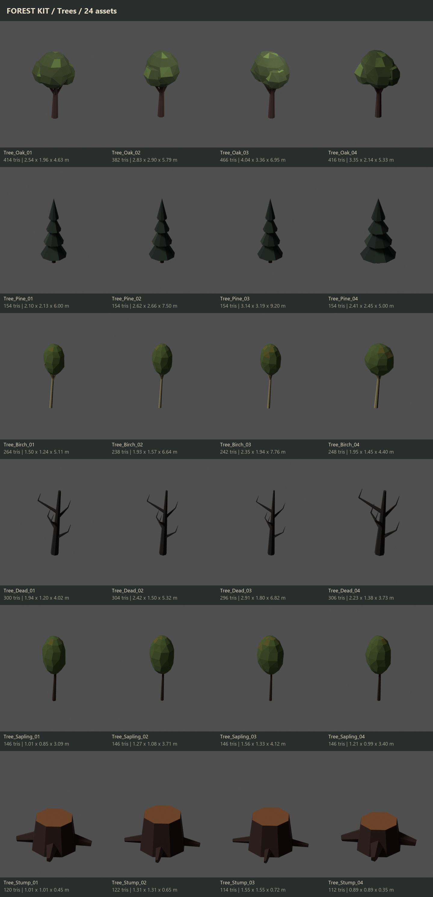
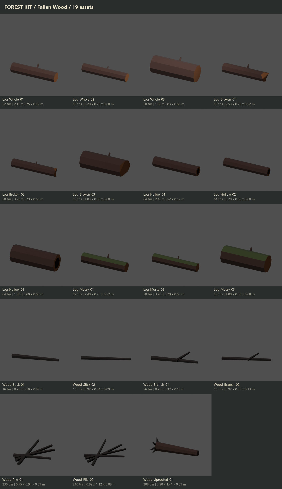
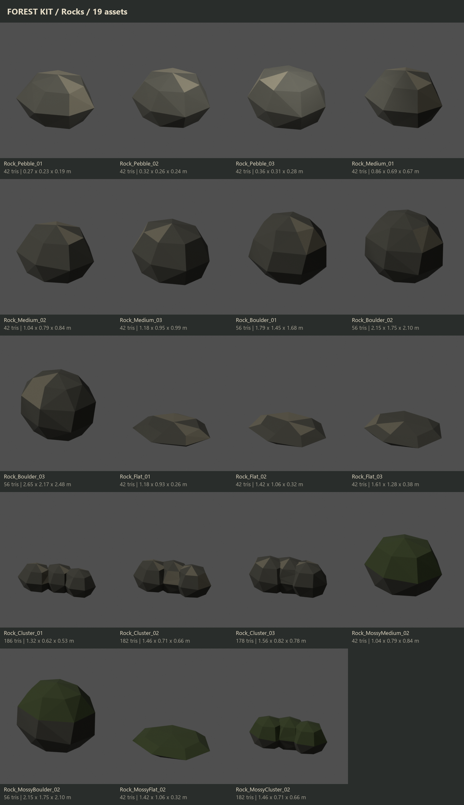
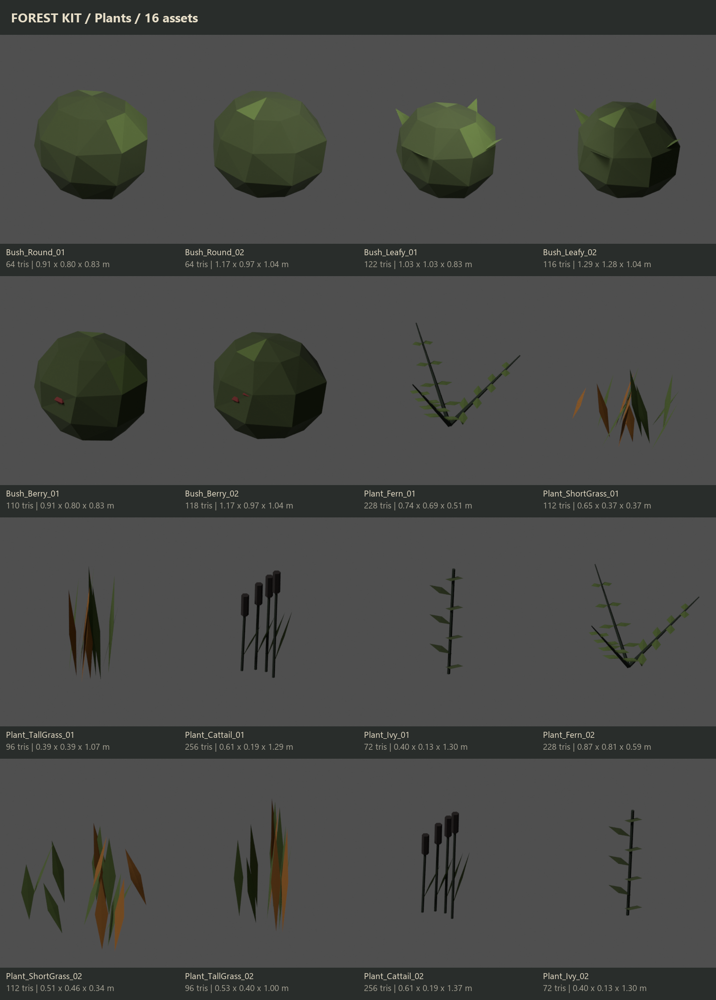
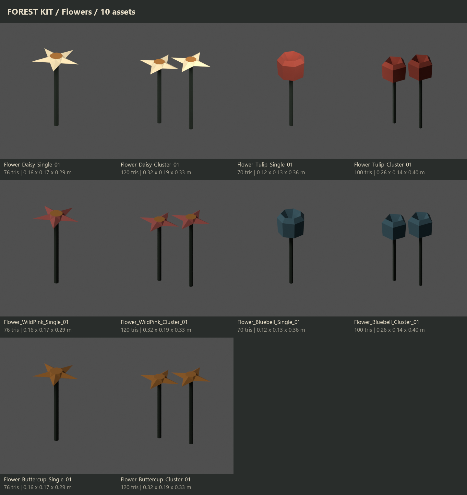
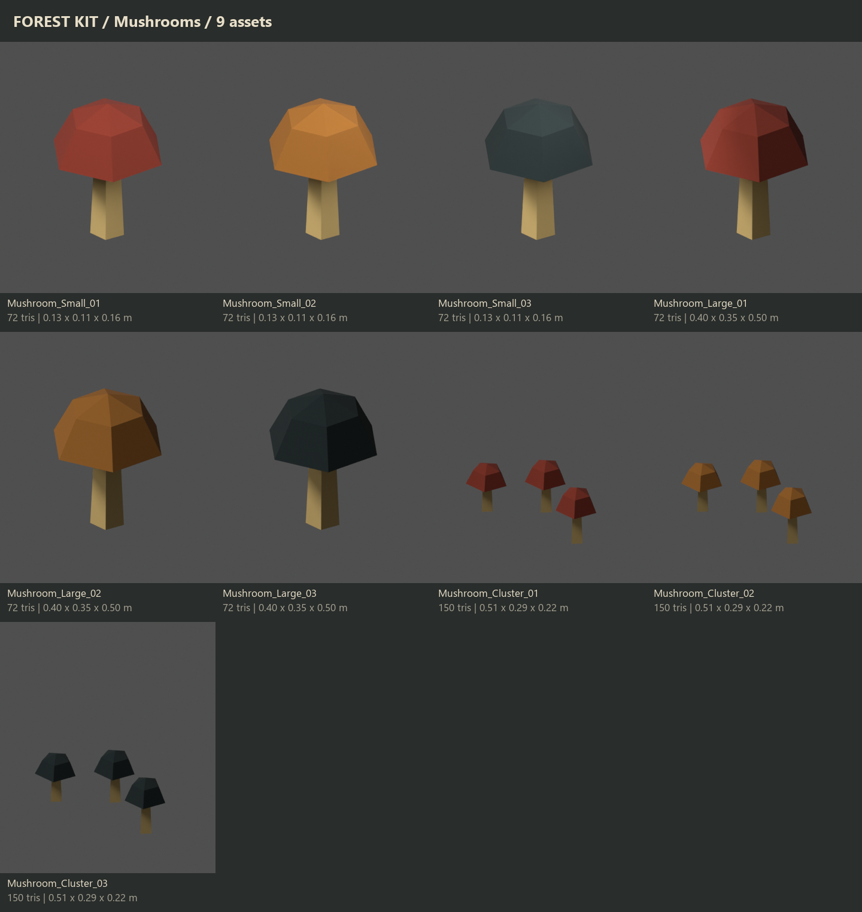
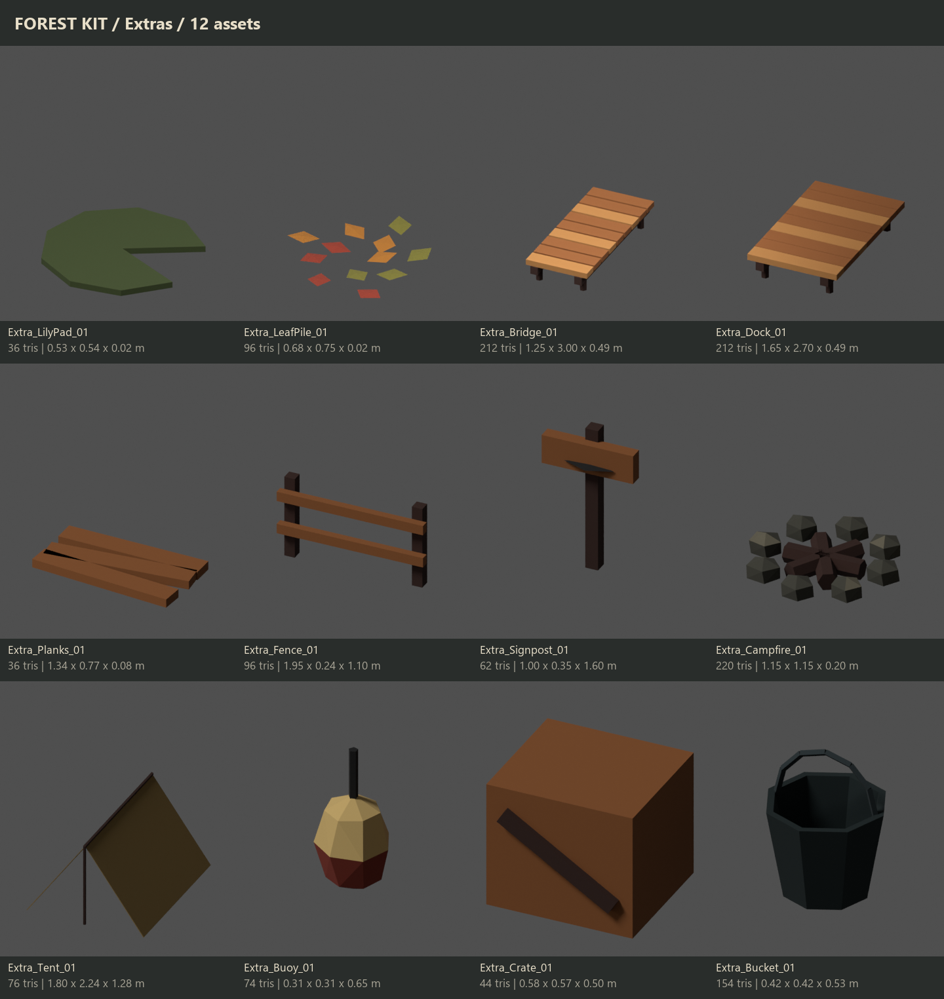

# Forest Environment Kit

109 original models built in Blender 5.2.2 LTS using blender-lpm-skill.

**Material:** `M_ForestPalette`, matte, non-metallic. One shared 256×256 colour-swatch atlas; no image detail, normal maps or PBR maps.

**Scale:** metres; Blender Z up / front −Y; FBX exported −Z forward / Y up, FBX Units Scale, Apply Transform enabled. Each exported asset root is at (0,0,0), with its origin at bottom centre. Meshes have applied transforms. The master .blend lays assets out in category rows at real scale.

**Wind:** trunks and foliage are distinct child meshes, with the same origin. Ivy foliage is separate too. Wind shaders are not included. Closed foliage attachment shells meet stems; these interfaces are intentionally kept separate for wind rather than welding foliage into wood.

**QA:** every asset is triangulated and flat shaded. Geometry checks include non-manifold edges, duplicate vertices, zero-area faces and UVs. All 109 individual FBXs were round-trip imported into Blender and checked for triangle count, ground pivot, metres and orientation. See `manifest.json` and `FBX_Roundtrip_QA.json`.

**Unity validation limitation:** Unity 6000.6.4f1 currently refuses to start because its Editor licence is unavailable. FBX validation in Unity has not been claimed. Once activated, run Roadkill → Forest Kit → Validate Imported Assets.

## Files

- `ForestKit.blend`: editable master, named collections by category.
- `ForestDemo.blend`: small assembled forest, pond, campsite and dock.
- `../../Assets/_Roadkill/Art/ForestKit/<category>/*.fbx`: individual assets.
- `../../Assets/_Roadkill/Art/ForestKit/ForestKit_All.fbx`: all 109 assets arranged in category rows as a browsable library; use individual FBXs for placement.
- `../../Assets/_Roadkill/Art/ForestKit/Demo/ForestDemo.fbx`: the arranged demonstration, with demo-only ground and pond meshes.
- `Previews/*_row.png`: each category in a three-quarter row, sizes normalized for readability.
- `Previews/*_sheet.png`: the same renders with names, true dimensions and triangle counts.
- `Asset_Summary.csv`: full asset table.
- `build_forest_kit.py`: reproducible asset recipe.

## Unity setup

1. Open the project after activating the Unity Editor licence. The import helper preserves authored normals, disables unnecessary animation data and assigns the one shared material.
2. Drag individual FBXs from `Assets/_Roadkill/Art/ForestKit` into your scene at scale (1,1,1).
3. Use a CapsuleCollider on tree trunks, a BoxCollider on planks/crates, and simple primitive colliders for rocks and logs. Plants, flowers, ivy and mushrooms normally have no collider.
4. Keep scenery static. For a movable log or crate, add a Rigidbody and primitive or convex colliders.
5. For wind, modify only children named `_Foliage`; keep the same shared material unless a foliage shader is needed.
6. To view the demo in Unity, drag `Demo/ForestDemo.fbx` into an empty scene, add a camera and directional light.

**Not included:** optional LOD1 meshes. Trees already use 146–466 triangles and boulders use 56. No gameplay, networking or level scripts were replaced.

## Category previews

### Trees — 24 assets

### Fallen_Wood — 19 assets

### Rocks — 19 assets

### Plants — 16 assets

### Flowers — 10 assets

### Mushrooms — 9 assets

### Extras — 12 assets

## Full summary table

| Asset name | Triangles | Material | Dimensions X × Y × Z (m) |
|---|---:|---|---|
| Tree_Oak_01 | 414 | M_ForestPalette | 2.540 × 1.961 × 4.634 |
| Tree_Oak_02 | 382 | M_ForestPalette | 2.832 × 2.895 × 5.793 |
| Tree_Oak_03 | 466 | M_ForestPalette | 4.041 × 3.357 × 6.952 |
| Tree_Oak_04 | 416 | M_ForestPalette | 3.351 × 2.144 × 5.330 |
| Tree_Pine_01 | 154 | M_ForestPalette | 2.095 × 2.127 × 6.000 |
| Tree_Pine_02 | 154 | M_ForestPalette | 2.619 × 2.659 × 7.500 |
| Tree_Pine_03 | 154 | M_ForestPalette | 3.142 × 3.191 × 9.200 |
| Tree_Pine_04 | 154 | M_ForestPalette | 2.409 × 2.446 × 5.000 |
| Tree_Birch_01 | 264 | M_ForestPalette | 1.504 × 1.240 × 5.107 |
| Tree_Birch_02 | 238 | M_ForestPalette | 1.932 × 1.572 × 6.638 |
| Tree_Birch_03 | 242 | M_ForestPalette | 2.354 × 1.937 × 7.762 |
| Tree_Birch_04 | 248 | M_ForestPalette | 1.945 × 1.448 × 4.397 |
| Tree_Dead_01 | 300 | M_ForestPalette | 1.941 × 1.199 × 4.022 |
| Tree_Dead_02 | 304 | M_ForestPalette | 2.424 × 1.499 × 5.320 |
| Tree_Dead_03 | 296 | M_ForestPalette | 2.907 × 1.799 × 6.818 |
| Tree_Dead_04 | 306 | M_ForestPalette | 2.231 × 1.379 × 3.726 |
| Tree_Sapling_01 | 146 | M_ForestPalette | 1.008 × 0.853 × 3.093 |
| Tree_Sapling_02 | 146 | M_ForestPalette | 1.268 × 1.081 × 3.710 |
| Tree_Sapling_03 | 146 | M_ForestPalette | 1.556 × 1.331 × 4.122 |
| Tree_Sapling_04 | 146 | M_ForestPalette | 1.212 × 0.995 × 3.402 |
| Tree_Stump_01 | 120 | M_ForestPalette | 1.006 × 1.006 × 0.450 |
| Tree_Stump_02 | 122 | M_ForestPalette | 1.310 × 1.310 × 0.650 |
| Tree_Stump_03 | 114 | M_ForestPalette | 1.553 × 1.553 × 0.720 |
| Tree_Stump_04 | 112 | M_ForestPalette | 0.885 × 0.885 × 0.350 |
| Log_Whole_01 | 52 | M_ForestPalette | 2.400 × 0.752 × 0.520 |
| Log_Whole_02 | 50 | M_ForestPalette | 3.200 × 0.792 × 0.600 |
| Log_Whole_03 | 50 | M_ForestPalette | 1.800 × 0.832 × 0.680 |
| Log_Broken_01 | 50 | M_ForestPalette | 2.529 × 0.752 × 0.520 |
| Log_Broken_02 | 50 | M_ForestPalette | 3.293 × 0.792 × 0.600 |
| Log_Broken_03 | 50 | M_ForestPalette | 1.833 × 0.832 × 0.680 |
| Log_Hollow_01 | 64 | M_ForestPalette | 2.400 × 0.520 × 0.520 |
| Log_Hollow_02 | 64 | M_ForestPalette | 3.200 × 0.600 × 0.600 |
| Log_Hollow_03 | 64 | M_ForestPalette | 1.800 × 0.680 × 0.680 |
| Log_Mossy_01 | 52 | M_ForestPalette | 2.400 × 0.752 × 0.520 |
| Log_Mossy_02 | 50 | M_ForestPalette | 3.200 × 0.792 × 0.600 |
| Log_Mossy_03 | 50 | M_ForestPalette | 1.800 × 0.832 × 0.680 |
| Wood_Stick_01 | 16 | M_ForestPalette | 0.750 × 0.178 × 0.089 |
| Wood_Stick_02 | 16 | M_ForestPalette | 0.923 × 0.344 × 0.089 |
| Wood_Branch_01 | 56 | M_ForestPalette | 0.750 × 0.318 × 0.128 |
| Wood_Branch_02 | 56 | M_ForestPalette | 0.923 × 0.385 × 0.128 |
| Wood_Pile_01 | 230 | M_ForestPalette | 0.750 × 0.935 × 0.089 |
| Wood_Pile_02 | 210 | M_ForestPalette | 0.923 × 1.124 × 0.089 |
| Wood_Uprooted_01 | 208 | M_ForestPalette | 3.282 × 1.413 × 0.893 |
| Rock_Pebble_01 | 42 | M_ForestPalette | 0.267 × 0.225 × 0.192 |
| Rock_Pebble_02 | 42 | M_ForestPalette | 0.321 × 0.257 × 0.240 |
| Rock_Pebble_03 | 42 | M_ForestPalette | 0.364 × 0.309 × 0.283 |
| Rock_Medium_01 | 42 | M_ForestPalette | 0.864 × 0.691 × 0.672 |
| Rock_Medium_02 | 42 | M_ForestPalette | 1.038 × 0.789 × 0.840 |
| Rock_Medium_03 | 42 | M_ForestPalette | 1.179 × 0.949 × 0.991 |
| Rock_Boulder_01 | 56 | M_ForestPalette | 1.794 × 1.452 × 1.680 |
| Rock_Boulder_02 | 56 | M_ForestPalette | 2.153 × 1.755 × 2.100 |
| Rock_Boulder_03 | 56 | M_ForestPalette | 2.649 × 2.166 × 2.478 |
| Rock_Flat_01 | 42 | M_ForestPalette | 1.179 × 0.932 × 0.256 |
| Rock_Flat_02 | 42 | M_ForestPalette | 1.415 × 1.064 × 0.320 |
| Rock_Flat_03 | 42 | M_ForestPalette | 1.607 × 1.281 × 0.378 |
| Rock_Cluster_01 | 186 | M_ForestPalette | 1.321 × 0.621 × 0.528 |
| Rock_Cluster_02 | 182 | M_ForestPalette | 1.462 × 0.714 × 0.660 |
| Rock_Cluster_03 | 178 | M_ForestPalette | 1.559 × 0.819 × 0.779 |
| Rock_MossyMedium_02 | 42 | M_ForestPalette | 1.038 × 0.789 × 0.840 |
| Rock_MossyBoulder_02 | 56 | M_ForestPalette | 2.153 × 1.755 × 2.100 |
| Rock_MossyFlat_02 | 42 | M_ForestPalette | 1.415 × 1.064 × 0.320 |
| Rock_MossyCluster_02 | 182 | M_ForestPalette | 1.462 × 0.714 × 0.660 |
| Bush_Round_01 | 64 | M_ForestPalette | 0.909 × 0.803 × 0.832 |
| Bush_Round_02 | 64 | M_ForestPalette | 1.169 × 0.973 × 1.040 |
| Bush_Leafy_01 | 122 | M_ForestPalette | 1.035 × 1.027 × 0.832 |
| Bush_Leafy_02 | 116 | M_ForestPalette | 1.293 × 1.284 × 1.040 |
| Bush_Berry_01 | 110 | M_ForestPalette | 0.909 × 0.803 × 0.832 |
| Bush_Berry_02 | 118 | M_ForestPalette | 1.169 × 0.973 × 1.040 |
| Plant_Fern_01 | 228 | M_ForestPalette | 0.737 × 0.686 × 0.505 |
| Plant_ShortGrass_01 | 112 | M_ForestPalette | 0.651 × 0.368 × 0.371 |
| Plant_TallGrass_01 | 96 | M_ForestPalette | 0.388 × 0.391 × 1.075 |
| Plant_Cattail_01 | 256 | M_ForestPalette | 0.615 × 0.187 × 1.291 |
| Plant_Ivy_01 | 72 | M_ForestPalette | 0.400 × 0.126 × 1.302 |
| Plant_Fern_02 | 228 | M_ForestPalette | 0.866 × 0.807 × 0.592 |
| Plant_ShortGrass_02 | 112 | M_ForestPalette | 0.506 × 0.457 × 0.344 |
| Plant_TallGrass_02 | 96 | M_ForestPalette | 0.527 × 0.404 × 1.001 |
| Plant_Cattail_02 | 256 | M_ForestPalette | 0.615 × 0.187 × 1.371 |
| Plant_Ivy_02 | 72 | M_ForestPalette | 0.400 × 0.126 × 1.302 |
| Flower_Daisy_Single_01 | 76 | M_ForestPalette | 0.163 × 0.171 × 0.294 |
| Flower_Daisy_Cluster_01 | 120 | M_ForestPalette | 0.320 × 0.191 × 0.334 |
| Flower_Tulip_Single_01 | 70 | M_ForestPalette | 0.124 × 0.127 × 0.360 |
| Flower_Tulip_Cluster_01 | 100 | M_ForestPalette | 0.258 × 0.135 × 0.400 |
| Flower_WildPink_Single_01 | 76 | M_ForestPalette | 0.163 × 0.171 × 0.294 |
| Flower_WildPink_Cluster_01 | 120 | M_ForestPalette | 0.320 × 0.191 × 0.334 |
| Flower_Bluebell_Single_01 | 70 | M_ForestPalette | 0.124 × 0.127 × 0.360 |
| Flower_Bluebell_Cluster_01 | 100 | M_ForestPalette | 0.258 × 0.135 × 0.400 |
| Flower_Buttercup_Single_01 | 76 | M_ForestPalette | 0.163 × 0.171 × 0.294 |
| Flower_Buttercup_Cluster_01 | 120 | M_ForestPalette | 0.320 × 0.191 × 0.334 |
| Mushroom_Small_01 | 72 | M_ForestPalette | 0.130 × 0.113 × 0.161 |
| Mushroom_Small_02 | 72 | M_ForestPalette | 0.130 × 0.113 × 0.161 |
| Mushroom_Small_03 | 72 | M_ForestPalette | 0.130 × 0.113 × 0.161 |
| Mushroom_Large_01 | 72 | M_ForestPalette | 0.400 × 0.346 × 0.496 |
| Mushroom_Large_02 | 72 | M_ForestPalette | 0.400 × 0.346 × 0.496 |
| Mushroom_Large_03 | 72 | M_ForestPalette | 0.400 × 0.346 × 0.496 |
| Mushroom_Cluster_01 | 150 | M_ForestPalette | 0.511 × 0.293 × 0.219 |
| Mushroom_Cluster_02 | 150 | M_ForestPalette | 0.511 × 0.293 × 0.219 |
| Mushroom_Cluster_03 | 150 | M_ForestPalette | 0.511 × 0.293 × 0.219 |
| Extra_LilyPad_01 | 36 | M_ForestPalette | 0.527 × 0.543 × 0.022 |
| Extra_LeafPile_01 | 96 | M_ForestPalette | 0.676 × 0.751 × 0.016 |
| Extra_Bridge_01 | 212 | M_ForestPalette | 1.250 × 3.000 × 0.490 |
| Extra_Dock_01 | 212 | M_ForestPalette | 1.650 × 2.700 × 0.490 |
| Extra_Planks_01 | 36 | M_ForestPalette | 1.343 × 0.769 × 0.080 |
| Extra_Fence_01 | 96 | M_ForestPalette | 1.950 × 0.240 × 1.100 |
| Extra_Signpost_01 | 62 | M_ForestPalette | 1.000 × 0.355 × 1.600 |
| Extra_Campfire_01 | 220 | M_ForestPalette | 1.151 × 1.149 × 0.200 |
| Extra_Tent_01 | 76 | M_ForestPalette | 1.800 × 2.242 × 1.282 |
| Extra_Buoy_01 | 74 | M_ForestPalette | 0.308 × 0.309 × 0.650 |
| Extra_Crate_01 | 44 | M_ForestPalette | 0.580 × 0.575 × 0.500 |
| Extra_Bucket_01 | 154 | M_ForestPalette | 0.420 × 0.420 × 0.532 |
